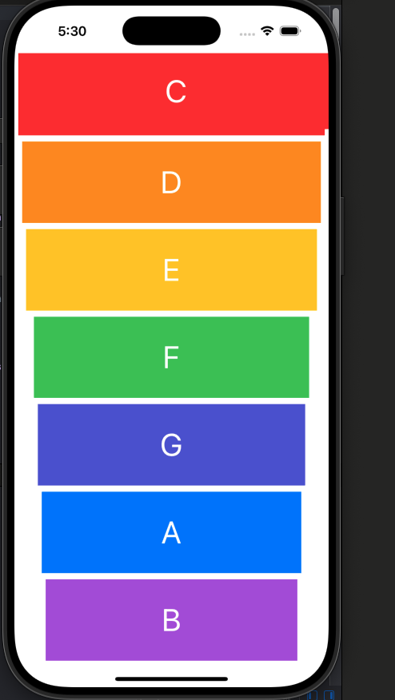

A simple iOS application that plays musical notes when buttons are tapped.
This project demonstrates how to use AVFoundation to play sounds in Swift.

Technologies Used

The project is built using Swift and UIKit. Audio playback is handled using the AVFoundation framework. The app was developed and tested using Xcode.
